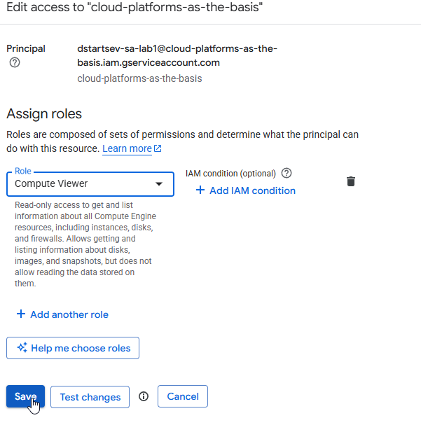
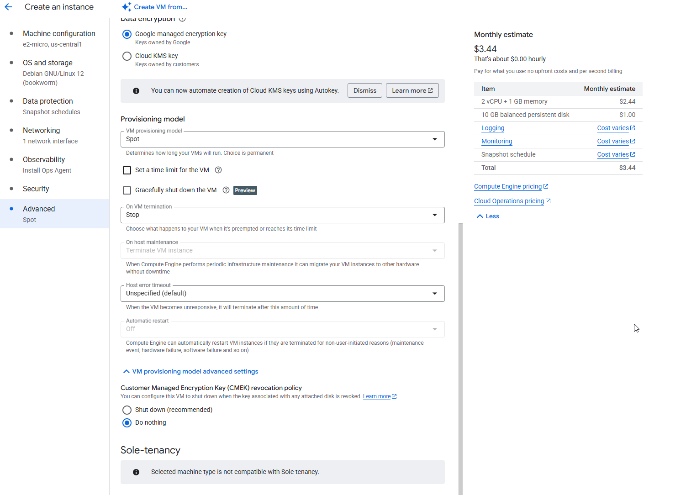
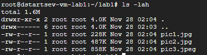

University: ITMO University
Faculty: FICT
Course: Cloud platforms as the basis of technology entrepreneurship
Author: Startsev Daniil
Lab: Lab1 "Обзор Google Cloud и исследование основных сервисов"
Date of create: 28.11.2025

## Цель работы

Ознакомиться с основными возможностями и преимуществами облачной платформы Google Cloud на примере сервисов IAM, Cloud Storage и Compute Engine.

## Описание используемых ресурсов

- Service Account: dstartsev-sa-lab1 с ролью Storage Admin (затем изменённой на Compute Viewer).  
- Виртуальная машина: dstartsev-vm-lab1 (e2-micro, Debian 12, Spot).  
- Объектное хранилище: бакет lab1-bucket-itmo для тестовых файлов.

## Ход работы

### 1. Получение доступа к Google Cloud

1. Заполнена Google Form, указана личная Gmail‑почта для выдачи доступа к проекту курса.  
2. После выдачи прав аккаунт появился в проекте Cloud Platforms as the Basis.  

### 2. Создание Service Account

1. В консоли GCP открыт раздел IAM & Admin → Service Accounts.  
2. Создан сервисный аккаунт с именем dstartsev-sa-lab1.
 
3. При создании назначена роль Storage Admin на уровне проекта, что даёт полный доступ к объектам Cloud Storage (просмотр, создание, удаление объектов и бакетов).
4. Cтраница редактирования service account с назначенной ролью Storage Admin / Compute Viewer (до и после изменения роли).
 

### 3. Создание виртуальной машины в Compute Engine

1. В разделе Compute Engine → VM instances создана новая VM с именем dstartsev-vm-lab1.  
2. Параметры:  
   - Machine type: e2-micro.  
   - OS: Debian GNU/Linux 12 (bookworm).  
   - Provisioning model: Spot, действие при прерывании — Stop.  

### 4. Установка gsutil на VM

1. По SSH выполнено подключение к dstartsev-vm-lab1.  
2. В системе уже были подключены репозитории Google Cloud (cloud-sdk-bookworm).
3. После выполнены команды установки Google Cloud CLI, включающего gsutil.
4. Создана локальная директория для файлов лабораторной работы.
5. Скопированы три файла из бакета на VM:  
- gsutil cp gs://lab1-bucket-itmo/pic1.jpg /root/lab1/
- gsutil cp gs://lab1-bucket-itmo/pic2.jpg /root/lab1/
- gsutil cp gs://lab1-bucket-itmo/pic3.jpeg /root/lab1/

6. Cоздание директории и вывод ошибки Permission denied при попытке создать каталог в `/viewer` после изменения прав доступа на Compute Viewer.

### 5. Очистка ресурсов

1. Удалена виртуальная машина dstartsev-vm-lab1 через раздел Compute Engine → VM instances.  

## Выводы

- В ходе лабораторной работы получен практический опыт работы с IAM, Compute Engine и Cloud Storage в Google Cloud.  
- Права доступа сервисного аккаунта напрямую влияют на возможность выполнять операции в gsutil: с ролью Storage Admin доступ к бакету lab1-bucket-itmo был полный (чтение и копирование файлов), а после замены роли на Compute Viewer операции с Cloud Storage стали недоступны.
- Использование сервисного аккаунта, привязанного к VM, позволяет безопасно работать с ресурсами GCP без хранения ключей и паролей внутри виртуальной машины.