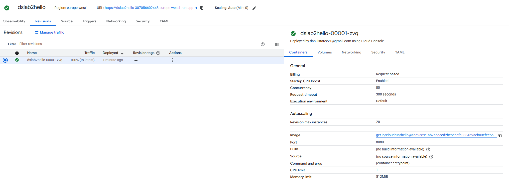
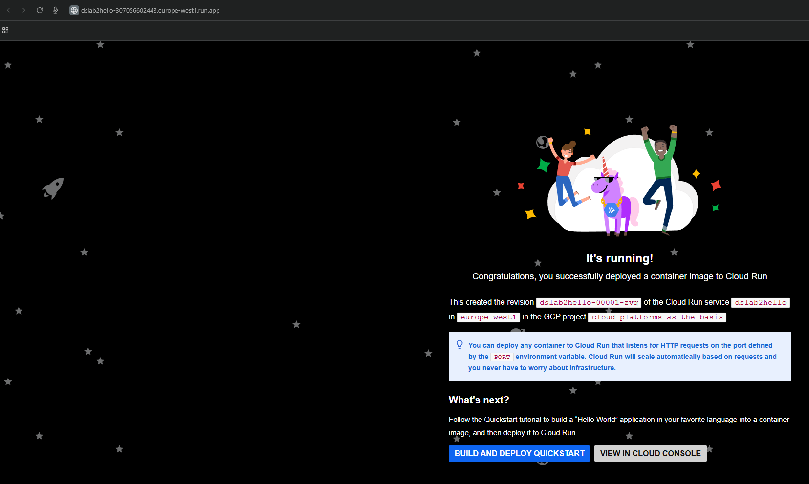
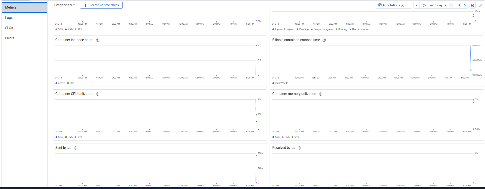
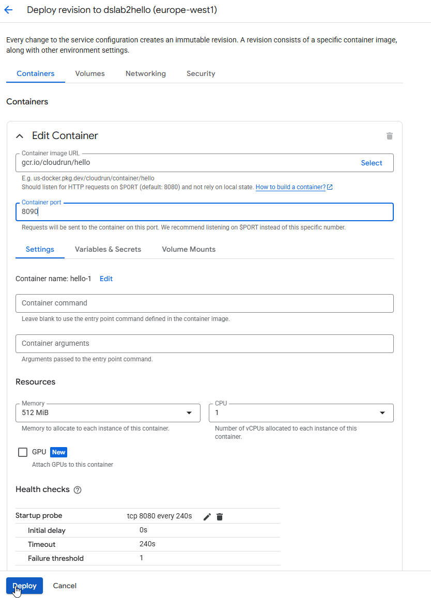

University: ITMO University
Faculty: FICT
Course: Cloud platforms as the basis of technology entrepreneurship
Year: 2024/2025
Author: Startsev Daniil
Lab: Lab2 "Исследование Cloud Run"
Date of create: 28.11.2025

## Цель работы

Ознакомиться с работой сервиса Google Cloud Run: развернуть контейнерный сервис, протестировать его работу, проанализировать логи и метрики, изменить конфигурацию (порт и распределение трафика между ревизиями) и оценить последствия этих изменений.

## Описание используемых ресурсов

- Сервис Cloud Run: hello-service (или фактическое имя сервиса), развернутый в регионе REGION (например, europe-westN).
- Контейнерный образ: дефолтный пример Hello World (из документации Cloud Run) или собственный сервис.
- Режим: полностью управляемый Cloud Run (managed).
- Конфигурация ресурсов:
  - vCPU: ~0.08–0.1
  - Память: 128–256 MB
  - Минимальное количество экземпляров: 0 (scale to zero)
- Доступ: разрешены неаутентифицированные запросы (Allow unauthenticated).

## Ход работы

### 1. Создание Cloud Run сервиса из дефолтного Hello

1. В веб‑консоли Google Cloud открыт раздел “Cloud Run”.
2. Нажал “Создать сервис” (Create Service).
3. В качестве способа деплоя выбран “Развернуть контейнерный образ” (Deploy one revision from an existing container image).
4. В поле “Container image URL” указан стандартный образ hello world (например, `gcr.io/cloudrun/hello` из документации Quickstart).
5. Выбран режим “Обслуживаемый Cloud Run (fully managed)”.
6. Настроены минимальные ресурсы:
   - небольшое количество vCPU,
   - память 128–256 MB,
   - минимальное число экземпляров = 0.
7. Включён доступ “Allow unauthenticated invocations”, чтобы можно было обращаться к сервису по публичному URL.
8. Нажата кнопка “Создать/Deploy”.

После успешного деплоя Cloud Run выдал URL.

### 2. Тестирование сервиса по ссылке

1. В браузере открыт URL сервиса, сгенерированный Cloud Run.
2. При обращении по ссылке сервис вернул страницу/ответ с текстом “Hello” или аналогичным приветствием (Hello World).
3. Для проверки сервис несколько раз обновлялся в браузере.
4. В отчёт добавлен скриншот ответа сервиса в браузере (страница Hello World).

### 3. Анализ логов и метрик Cloud Run

#### 3.1. Логи

1. В интерфейсе Cloud Run выбран созданный сервис.
2. Перейдено на вкладку “Логи” (Logs).
3. Сервис несколько раз был вызван из браузера, после чего в логах отобразились новые записи:
   - HTTP‑метод (GET),
   - путь (например, `/`),
   - код ответа (200),
   - время ответа (latency),
   - информация о пользователе (User-Agent).
4. На скриншоте логов видно соответствие между обращениями из браузера и появляющимися лог‑записями.

#### 3.2. Метрики

1. В интерфейсе Cloud Run открыта вкладка “Metrics”.
2. На графиках наблюдается:
   - число запросов (Requests),
   - латентность (Latency),
   - при дополнительном анализе — потребление CPU и памяти.
3. После серии запросов из браузера на графике запросов появился небольшой пик.
4. В отчёт добавлен скриншот графика метрик с отметками по запросам.

### 4. Изменение порта на 8090

#### 4.1. Изменение порта на 8090

1. В интерфейсе Cloud Run для существующего сервиса выбрано “Редактировать и развернуть новую ревизию” (Edit and deploy new revision).
2. В конфигурации контейнера открыт раздел с переменными окружения (Environment variables).
3. Добавлена/изменена переменная:
   - Name: `PORT`
   - Value: `8090`
4. Сохранены изменения и развернута новая ревизия сервиса
5. В разделе “Revisions” теперь отображаются две ревизии:
   - старая ревизия (слушает порт по умолчанию, например 8080),
   - новая ревизия с изменённым значением переменной PORT = 8090.
   

### 5. Удаление созданных сервисов

1. После завершения экспериментов выбран сервис Cloud Run.
2. Через меню действий выполнена команда “Удалить” (Delete).
3. Подтверждено удаление сервиса.
4. Проверено, что в разделе Cloud Run нет оставшихся активных сервисов.

Это позволяет избежать лишних расходов на ресурсы.

## Выводы

- В ходе лабораторной работы были изучены базовые возможности Cloud Run:
  - развёртывание контейнерного сервиса из готового образа;
  - доступ к сервису по сгенерированному URL;
  - анализ логов и метрик работы сервиса.
- Было показано, что Cloud Run создаёт ревизии сервиса при изменении конфигурации (например, переменной `PORT`) и позволяет гибко управлять распределением трафика между этими ревизиями.
- Изменение порта, на котором слушает сервис, критично: если приложение не читает значение переменной `PORT`, изменение приводит к некорректной работе или ошибкам. Если же приложение адаптировано к этой переменной, изменение порта не нарушает работу.
- Cloud Run упрощает масштабирование и управление версиями приложений, позволяя быстро деплоить новые ревизии, анализировать их поведение по логам/метрикам и плавно переключать трафик между версиями без ручного управления инфраструктурой.

