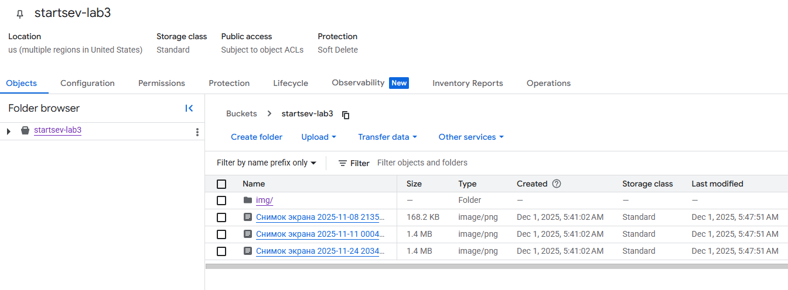
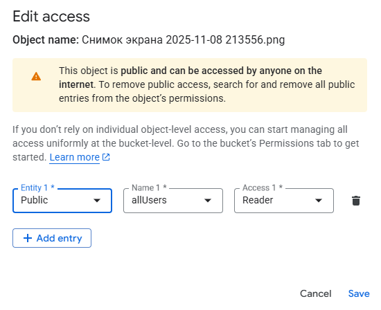

University: ITMO University
Faculty: FICT
Course: Cloud platforms as the basis of technology entrepreneurship
Year: 2024/2025
Author: Startsev Daniil
Lab: Lab3 "Исследование Cloud Storage"
Date of create: 01.12.2025

## Цель работы

Изучить основные понятия и принципы работы облачных хранилищ, на примере сервиса Google Cloud Storage создать бакет, выполнить загрузку и организацию объектов, а также исследовать механизмы управления доступом и ограничения публичного доступа в учебном проекте.

## Ход работы

1. Создание бакета Cloud Storage
В меню консоли открыт раздел Cloud Storage → Buckets (страница обозревателя объектов).​

Нажата кнопка Create и создан бакет с уникальным именем вида startsev-lab3 с указанием региона по умолчанию и стандартного класса хранения.​

Остальные параметры версионирования и защиты объектов оставлены по умолчанию, так как методические указания дополнительных требований не содержали.​

2. Загрузка изображений в бакет
Внутри созданного бакета на вкладке Objects нажата кнопка Upload files.​

С локального компьютера выбраны 3–4 PNG‑изображения и загружены в корень бакета, после чего в таблице объектов отобразились соответствующие записи.​

(скрин со списком загруженных файлов)

3. Создание «папки» и перенос файлов
В бакете создана логическая папка с именем img с помощью кнопки Create folder.​

В списке объектов отмечены все ранее загруженные изображения, после чего выполнена операция Move с указанием целевого пути img/.​

После обновления списка объектов файлы отобразились внутри папки img, что подтверждает корректную работу объектных префиксов.​

Для каждого файла получен Public URL

## Результаты
В ходе выполнения лабораторной работы были получены следующие результаты:​

Освоены базовые операции работы с Google Cloud Storage через веб‑консоль: создание бакета, загрузка объектов, логическая организация данных с помощью «папок».

## Выводы
Google Cloud Storage предоставляет удобный и наглядный интерфейс для работы с объектным хранилищем, позволяя быстро создавать бакеты, загружать и структурировать данные без ручного управления физическими ресурсами. Разделение ответственности между пользователем и облачным провайдером упрощает масштабирование и повышение отказоустойчивости хранилища.