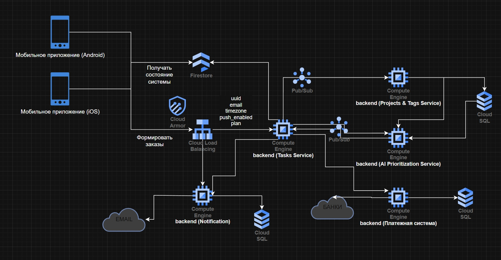

University: ITMO University
Faculty: FICT
Course: Cloud platforms as the basis of technology entrepreneurship
Year: 2025/2026
Group: K34202
Author: Startsev Daniil
Lab: Lab4. Разработка инфраструктуры MVP AI приложения
Date of create: 02.12.2025


## Цель работы

Спроектировать архитектуру и экономическую модель MVP AI‑приложения для трёх стадий развития (начальное состояние, тестирование партнёрами, продуктивная эксплуатация), выбрать оптимальные облачные ресурсы Google Cloud Platform и обосновать решения с точки зрения стоимости и масштабируемости.

***

## Описание AI‑приложения

**Название**: AI Task Prioritizer — сервис напоминаний о делах с AI‑приоритизацией.

**Основная функциональность**:

- Пользователь создаёт задачи (личные/рабочие) через мобильное приложение или веб‑интерфейс.
- AI‑ассистент анализирует список задач пользователя (дедлайны, категории, историю выполнения) и автоматически расставляет приоритеты.
- Сервис отправляет напоминания (push‑уведомления, e‑mail) о приближении дедлайнов и предлагает порядок выполнения задач на день.
- Система хранит историю выполненных задач и строит базовую аналитику продуктивности.

**Целевая аудитория**: занятые специалисты, студенты, фрилансеры, которым нужен умный планировщик с минимальным ручным управлением.

***

## Требования к системе

1. **Мобильное приложение** для создания и управления задачами (iOS/Android).
2. **Система напоминаний** (push‑уведомления, e‑mail, SMS) о приближении дедлайнов.
3. **AI‑функция приоритизации задач** на основе дедлайнов, категорий и истории выполнения.
4. Возможность **группировки задач** по проектам/категориям и фильтрации.
5. **Личный кабинет** с авторизацией по номеру телефона, e‑mail и OAuth.
6. Функция **планирования дня/недели**, где AI предлагает рекомендованный порядок выполнения задач.
7. **История выполненных задач** и изменений (отметка «сделано», переносы дедлайна).
8. **Система уведомлений о конфликте задач** (перегруженный день, пересечение по времени) с AI‑подсказками.
9. **Биллинговая система** с гибкими тарифами (бесплатный базовый план и платный доступ к расширенной AI‑аналитике).

***

## Архитектура микросервисов

Для обеспечения гибкости и масштабируемости приложение разбито на следующие микросервисы:




### Основные пользовательские сервисы

1. **Auth \& Users Service** — регистрация, авторизация (телефон/e‑mail/OAuth), управление профилем.
2. **Tasks Service** — CRUD для задач, статусы, дедлайны, история изменений.
3. **Projects \& Tags Service** — управление проектами/тегами, фильтрация задач.
4. **Notification Service** — отправка push‑уведомлений, e‑mail, SMS.
5. **AI Prioritization Service** — вычисление приоритетов и рекомендаций по порядку выполнения.
6. **Planning \& Conflicts Service** — построение плана дня/недели, выявление конфликтов задач.

### Инфраструктурные сервисы

7. **Billing \& Subscription Service** — управление тарифами и подписками.
8. **Payment Gateway Service** — интеграция с платёжными провайдерами.
9. **History \& Analytics Service** — агрегация истории и построение аналитики.
10. **API Gateway / BFF** — единая точка входа для клиентов, проксирование запросов.
11. **Logging \& Monitoring Service** — сбор логов, метрик и алертов.

***

## Формат данных пользователя

Для работы микросервисов используется JSON‑формат профиля пользователя:

```json
{
  "user_id": "uuid-строка",
  "created_at": "2025-12-01T16:00:00Z",
  "phone_numbers": [
    {
      "number": "+79991234567",
      "verified": true,
      "preferred": true
    }
  ],
  "emails": [
    {
      "email": "user@example.com",
      "verified": false,
      "preferred": false
    }
  ],
  "auth_providers": ["password", "google_oauth"],
  "profile": {
    "full_name": "Иван Иванов",
    "timezone": "Europe/Moscow",
    "language": "ru"
  },
  "notification_settings": {
    "push_enabled": true,
    "email_enabled": true,
    "sms_enabled": false,
    "daily_digest_time": "20:00"
  },
  "ai_preferences": {
    "work_hours_start": "09:00",
    "work_hours_end": "18:00",
    "weekends": ["SAT", "SUN"],
    "priority_style": "deadline_first"
  },
  "billing": {
    "plan": "pro",
    "plan_renews_at": "2026-01-01T00:00:00Z",
    "is_trial": false
  }
}
```

***

## Pub/Sub в архитектуре

Для развязки микросервисов используется паттерн **Pub/Sub** через Google Cloud Pub/Sub:

- **Tasks Service** публикует события о создании/изменении задач в топик `task.events`.
- **Notification Service**, **AI Prioritization Service**, **History \& Analytics Service** подписаны на топик и независимо обрабатывают события.

**Преимущества**:

- Асинхронность: быстрый ответ пользователю, фоновая обработка событий.
- Развязка: добавление нового подписчика не требует изменения публикующего сервиса.
- Масштабируемость: возможность добавления воркеров для обработки пиковых нагрузок.

***

## Схема инфраструктуры

Схемы для трёх состояний созданы в draw.io и представлены ниже.

### Состояние 1: Начальное (MVP)

**Описание потока данных**:

1. Пользователь через мобильное приложение или веб‑клиент отправляет HTTPS‑запрос.
2. Запрос проходит через Cloud Armor (защита от DDoS) и Load Balancer.
3. API Gateway направляет запрос к нужному микросервису (Tasks, Notification, AI).
4. Tasks Service записывает данные в Cloud SQL и публикует событие в Pub/Sub.
5. Подписчики (Notification, AI) получают событие и обрабатывают асинхронно.
6. AI Prioritization Service обращается к внешнему LLM API (Gemini Flash) для генерации рекомендаций.
7. Firestore хранит профили пользователей для быстрого доступа.
8. Cloud Storage используется для хранения логов и бэкапов.

***

### Состояние 2: Тестирование партнёрами

**Изменения относительно MVP**:

- Добавлено авто‑масштабирование: 2 инстанса каждого основного микросервиса.
- Cloud SQL переведена на dedicated‑инстанс db-standard-1 с Read Replica для аналитики.
- Добавлен Cloud Memorystore (Redis) для кэширования AI‑ответов.
- Включён Cloud Monitoring с алертами в Slack/Email.
- Увеличено хранилище Cloud Storage до 200 GiB для логов и экспорта аналитики.

***

### Состояние 3: Продовое решение

**Изменения относительно тестирования**:

- Развёртывание в нескольких зонах доступности (Multi-AZ) для отказоустойчивости.
- Переход на Kubernetes (GKE) с авто‑масштабированием подов по метрикам CPU/RAM.
- Cloud SQL в режиме High Availability с автоматическим failover.
- Отдельный Data Warehouse (BigQuery) для долгосрочной аналитики и ML.
- Гибридная модель AI: часть запросов через self-hosted модель (дешевле при больших объёмах), часть через внешний API.
- CI/CD pipeline (Cloud Build + Artifact Registry) для автоматического деплоя.
- Centralized logging (Cloud Logging) и distributed tracing (Cloud Trace).

***

## Экономическая модель

### Состояние 1: Начальное (MVP)

**Предполагаемая нагрузка**: 50–100 пользователей, ~500 задач/день, минимальная AI‑активность.


| Компонент | Конфигурация | Стоимость/мес |
| :-- | :-- | :-- |
| **Compute Engine** | 3× e2-small (0.5 vCPU, 2GB RAM) | \$39.69 |
| **Cloud SQL** | 1× db-g1-small (shared vCPU, 1.7GB RAM) | \$32.33 |
| **Cloud Storage** | 50 GiB Standard Storage | \$0.90 |
| **Pub/Sub** | ~100K сообщений/мес | \$1–2 |
| **Firestore** | Профили ~100 пользователей (free tier) | \$0–3 |
| **AI API (Gemini Flash)** | 50 польз. × 20 запр./день × 2K токенов | \$10–20 |
| **Load Balancer** | Минимальная нагрузка | \$5–8 |
| **Logging \& Monitoring** | Базовые логи | \$3–5 |
| **Итого** |  | **\$92–118/мес** |

**Обоснование выбора**:

- **Compute Engine e2-small**: серия E2 оптимизирована по цене для небольших нагрузок, подходит для легких микросервисов. Альтернатива Cloud Run (serverless) была бы дешевле при редких запросах, но для стабильной нагрузки VM экономичнее.
- **Cloud SQL db-g1-small**: shared-core инстансы в 3–4 раза дешевле dedicated, достаточно для хранения задач и истории до 1000 пользователей.
- **Pub/Sub**: минимальная стоимость при MVP-нагрузках, развязывает сервисы и упрощает добавление новых подписчиков.
- **External LLM API**: на MVP дешевле использовать внешний API (\$10–20/мес), чем разворачивать GPU-инстанс (\$200–500/мес).

***

### Состояние 2: Тестирование партнёрами

**Предполагаемая нагрузка**: 500–1000 пользователей, ~5–10K задач/день, активная AI‑обработка.


| Компонент | Конфигурация | Стоимость/мес |
| :-- | :-- | :-- |
| **Compute Engine** | 7× e2-medium (1 vCPU, 4GB RAM) | \$130–150 |
| **Cloud SQL** | 1× db-standard-1 (1 vCPU, 3.75GB) + Read Replica | \$100–120 |
| **Cloud Memorystore (Redis)** | 1GB cache | \$30–40 |
| **Cloud Storage** | 200 GiB Standard Storage | \$4 |
| **Pub/Sub** | ~1M сообщений/мес | \$5–8 |
| **Firestore** | Профили ~1000 пользователей | \$5–10 |
| **AI API + Cache** | Снижение запросов на 40% за счёт кэша | \$30–50 |
| **Load Balancer** | Средняя нагрузка | \$15–20 |
| **Logging \& Monitoring** | Расширенные метрики + алерты | \$15–25 |
| **Итого** |  | **\$334–427/мес** |

**Обоснование изменений**:

- **Переход на e2-medium**: увеличение RAM для обработки большего числа одновременных запросов, добавление 2-х инстансов каждого микросервиса для отказоустойчивости.
- **Cloud SQL db-standard-1 + Replica**: переход на dedicated-инстанс для стабильной производительности, Read Replica для аналитических запросов без нагрузки на основную БД.
- **Cloud Memorystore (Redis)**: кэширование частых AI-ответов снижает количество дорогих запросов к LLM на 30–40%, окупается уже при 500+ пользователях.
- **Monitoring с алертами**: обязателен на этапе тестирования,

